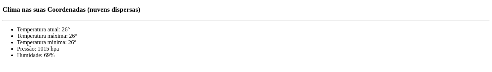

## Projeto de treinamento para fazer consumo de api externas

- Dentro do <b>README</b> da pasta do projeto está tudo que foi ou está sendo usando.
   * https://github.com/thiagoadssilva/netflixClone/blob/main/clone/README.md

## <b>Inicio</b> do desenvolvimento do clone

